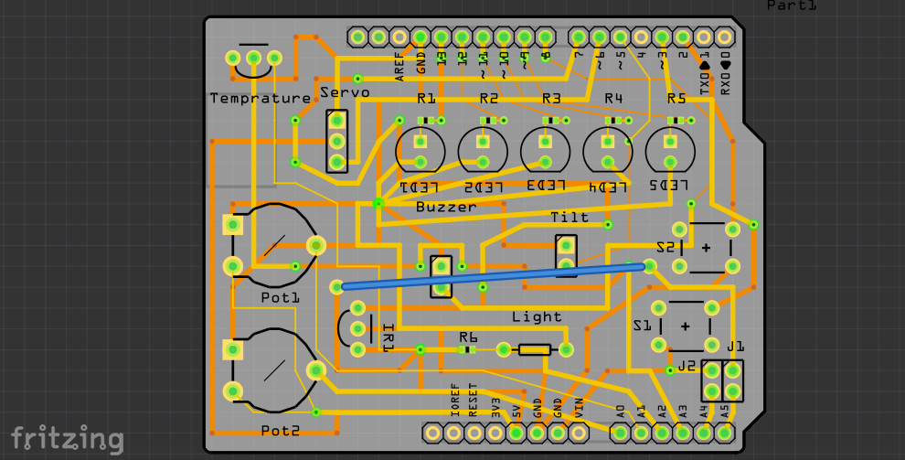

# Electronic-kit-on-a-shield
A shield which has all the electronic components to get started with the arduino ecosystem.

# Components
1) LEDs: 13-9
2) Servo: 6
3) Tilt switch: 5
4) Push button: 2 & 3
5) IR reciever: 7
6) Potentiometre: A0 & A1
7) Light senesor: A2
8) Temprature sensor: A3
9) Buzzer: 8

Note:- pin 4 is not used. So, you can connect other components.

# Circuit board

